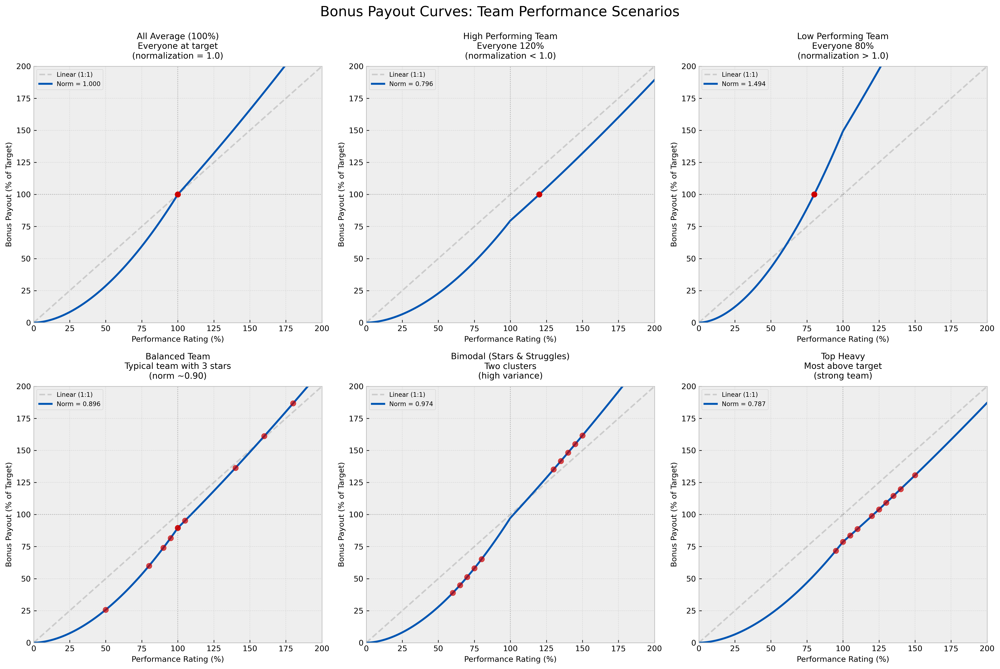

# Bonus Calculation - Manager's Guide

## Overview

The **Bonus Calculation** feature distributes your team's total bonus pool based on individual performance ratings. It ensures that:

1. **The total equals your budget** - All bonuses add up exactly to your total bonus pool (sum of all individual targets from Workday)
2. **High performance is rewarded exponentially** - Exceptional performers receive disproportionately higher bonuses
3. **Low performance is penalized appropriately** - Underperformance results in below-target bonuses
4. **The system is fair and transparent** - Everyone can see how the calculation works

## How It Works (The Simple Version)

Think of the bonus calculation as a three-step process:

### Step 1: Start with Each Person's Target
Every employee has a bonus target from Workday (typically a percentage of their salary). This is their baseline - what they'd receive if everyone performed at 100% and we simply paid out targets.

### Step 2: Adjust for Performance
We modify each person's share based on their performance rating:
- **Rating above 100%**: Gets an exponential boost (e.g., 120% rating gets much more than 20% extra)
- **Rating at 100%**: Gets close to their target amount
- **Rating below 100%**: Gets an exponential penalty (e.g., 80% rating gets much less than 80% of target)

This creates a **performance curve** that rewards excellence and addresses underperformance.

### Step 3: Normalize to Your Budget
After calculating everyone's "raw shares" based on performance, we scale everything proportionally so the total exactly matches your bonus pool. This ensures you stay on budget while maintaining the relative differences created by the performance curve.

## Performance-to-Bonus Curve

The chart below shows how different team performance scenarios affect bonus payouts through the normalization mechanism.

Each panel shows a different team composition with red dots representing individual team members. The curves demonstrate how the normalization factor adjusts payouts to match the total bonus pool:
- **Balanced Team** (norm ~0.90): Three exceptional stars compress the budget, so a 100% performer gets ~90% of target
- **All Average Team** (norm = 1.0): Everyone at 100% rating gets exactly their target bonus
- **Low Performing Team** (norm ~1.5): Budget surplus means everyone gets more than their raw calculation

## The Algorithm (Slightly More Technical)

For each employee, we calculate:

1. **Performance Multiplier**
   - If rating < 100%: `(rating/100) ^ downside_exponent`
   - If rating ≥ 100%: `(rating/100) ^ upside_exponent`
   - Example: With defaults, a 120% rating gets `1.20^1.35 = 1.28x` their target
   - Example: With defaults, an 80% rating gets `0.80^1.9 = 0.65x` their target

2. **Raw Share**
   - `Bonus Target × Performance Multiplier`

3. **Final Bonus**
   - `Raw Share × Normalization Factor`
   - The normalization factor ensures total bonuses = total pool

## Configuration Parameters

You can experiment with two parameters to adjust how aggressive the curve is:

### Upside Exponent (Default: 1.35)
- Controls the reward for ratings ≥ 100%
- **Higher value** (e.g., 1.5): More aggressive rewards for top performers
- **Lower value** (e.g., 1.0): More linear, less exponential reward
- Example impact on 120% rating:
  - At 1.0: 120% of target
  - At 1.35: 128% of target
  - At 1.5: 131% of target

### Downside Exponent (Default: 1.9)
- Controls the penalty for ratings < 100%
- **Higher value** (e.g., 2.0): Harsher penalties for underperformance
- **Lower value** (e.g., 1.5): Softer penalties
- Example impact on 80% rating:
  - At 1.5: 72% of target
  - At 1.9: 65% of target
  - At 2.0: 64% of target

## Reading the Results

The Bonus Calculation page shows:

### Summary Statistics
- **Total Bonus Pool**: Your total budget (sum of all targets from Workday)
- **Total Allocated**: What you're actually paying out (should equal pool)
- **Rated Employees**: How many people received bonuses
- **Value per Share**: The normalization factor applied

### Individual Results Table
For each employee, you'll see:

- **Rating %**: Their performance rating you assigned
- **Bonus Target**: Their target from Workday (in USD)
- **Perf Mult**: Performance multiplier calculated from the rating
- **Final Bonus**: The actual bonus they'll receive
- **% of Target**: How their final bonus compares to their target
  - **Green** (>100%): Above target
  - **Red** (<100%): Below target

## What to Look For

### Good Signs
- Top performers (120%+) receive significantly more than their targets
- Solid performers (90-110%) receive close to their targets
- The spread feels appropriate for your team's performance distribution
- Total allocated exactly matches your total pool

### Things to Adjust
If the results don't feel right, try adjusting the parameters:

- **Top performers not rewarded enough?** → Increase upside exponent
- **Underperformers penalized too harshly?** → Decrease downside exponent
- **Want more dramatic differentiation?** → Increase both exponents
- **Want softer curve?** → Decrease both exponents

## Important Notes

### Currency Handling
The system automatically handles employees in different countries:
- For US employees: Uses "Bonus Target - Local Currency" (already in USD)
- For non-US employees: Uses "Bonus Target - Local Currency (USD)" (converted)
- All calculations and displays are in USD

### Missing Data
If some rated employees don't appear in the calculation, they're likely missing bonus target data in the Workday export. Ensure your export includes the bonus target columns for all employees.

### Current Limitations
1. **One-time calculation**: This is a planning tool. The results are not automatically saved or exported to Workday.

## Example Scenarios

### Scenario 1: Conservative Approach
- Upside: 1.1 (modest rewards)
- Downside: 1.5 (softer penalties)
- Result: Smaller spread between high and low performers

### Scenario 2: Aggressive Differentiation
- Upside: 1.5 (strong rewards)
- Downside: 2.0 (harsh penalties)
- Result: Large spread, top performers get much more

### Scenario 3: Balanced (Default)
- Upside: 1.35 (meaningful rewards)
- Downside: 1.9 (appropriate penalties)
- Result: Reasonable differentiation while staying fair

## Workflow Recommendation

1. **Complete all performance ratings** on the "Rate Team" tab first
2. **Review distribution** on the Analytics tab to ensure ratings are calibrated
3. **Run bonus calculation** with default parameters
4. **Adjust parameters** if the results don't align with your intent
5. **Document your final parameters** for consistency and future reference
6. **Export results** (future feature) or manually record for HR processing

## Questions or Issues?

- **Why don't all my rated employees show up?** → Check that they have bonus target data in the Workday export
- **Why does total allocated slightly differ from pool?** → It shouldn't - if it does, this is a bug. They should match exactly.
- **Can I save different parameter sets?** → Not yet, but you can document your preferred parameters
- **How do I export the results?** → Currently manual (copy/paste from UI). Future versions will include CSV export.

## Technical Details

For technical documentation on the implementation, see `phase-two-prompt.md` and the code in `app.py` (the `bonus_calculation()` function).
