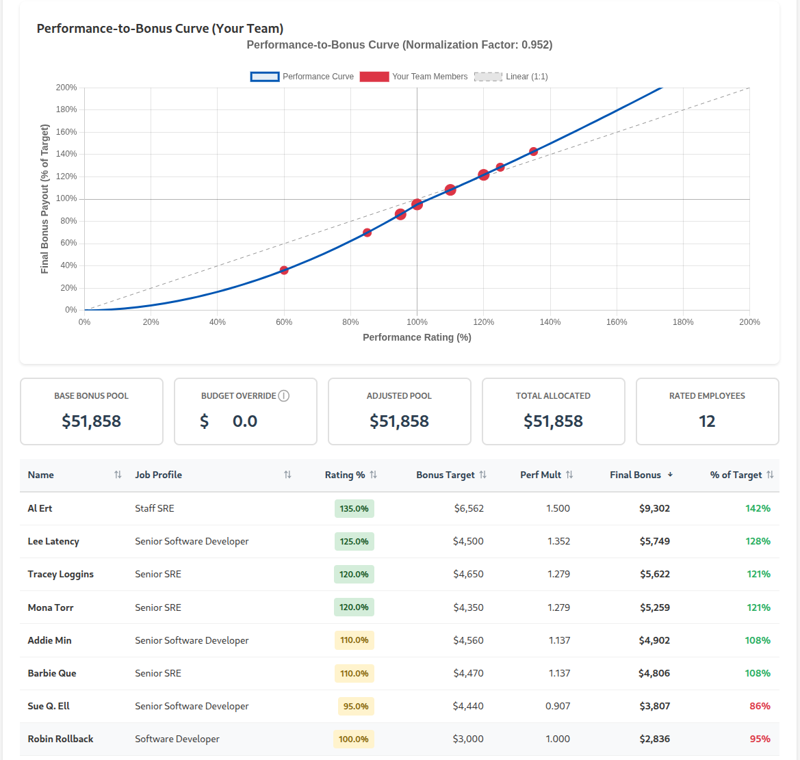

# Performance Rating System

A web-based tool for managers to conduct performance reviews and calculate team bonuses with algorithmic fairness.

## Features

- **Performance Rating Interface**: Rate team members on a 0-200% scale with justification
- **Auto-save**: Ratings save automatically as you work (2-second delay)
- **Analytics Dashboard**: View team performance distribution with calibration guidance
- **Bonus Calculation**: Algorithmic bonus allocation with configurable parameters
- **Fixed Pool Guarantee**: Total bonuses always equal your budget (sum of targets)
- **International Support**: Handles multiple currencies (USD, GBP, EUR, CAD, INR)
- **Privacy-Focused**: SQLite database, runs locally, no cloud dependencies


*Performance-to-bonus allocation curve showing how ratings translate to bonuses with proportional scaling*

## Quick Start with Sample Data

Try the system immediately with fictitious demo data. Choose either:

### Option 1: Small Team (Recommended for First-Time Users)
Perfect for learning the system - 12 employees under one manager with sample ratings/justifications.

```bash
# 1. Install dependencies
pip install -r requirements.txt

# 2. Generate small team Workday data (salaries, bonus targets, org structure)
python3 create_sample_data.py

# 3. Import Workday data to database
python3 convert_xlsx.py sample-data-small.xlsx

# 4. Populate sample ratings and justifications
python3 populate_sample_ratings.py small

# 5. Start the web server
python3 app.py

# 6. Open browser to http://localhost:5000
```

### Option 2: Large Multi-Manager Organization
Test multi-org scenarios - 50 employees across 5 managers with sample ratings.

```bash
# 2. Generate large org Workday data
python3 create_sample_data.py --large

# 3. Import Workday data to database
python3 convert_xlsx.py sample-data-large.xlsx

# 4. Populate sample ratings and justifications
python3 populate_sample_ratings.py large

# (Continue with steps 5-6 above)
```

**Sample Data Details:**
- **Small**: 12 employees (Software Developers & SREs), 1 manager (Della Gate)
- **Large**: 50 employees across 5 managers (Della Gate, Rhoda Map, Kay P. Eye, Agie Enda, Mai Stone)
- Both include international employees (GBP) for testing multi-currency support

**Architecture Note**: Sample data generation follows the same pattern as real usage:
1. **Workday export** (create_sample_data.py) contains ONLY HR data: salaries, bonus targets, org structure
2. **Manager ratings** (populate_sample_ratings.py) adds performance ratings and justifications to the DATABASE
3. This separation mirrors reality: Workday data vs. local manager-entered ratings

**What you get:**
- ✅ Complete Workday employee data (salary, bonus targets, job profiles)
- ✅ Sample performance ratings (45-185% range) and justifications
- ✅ Empty mentor/mentee/AI fields for you to fill in
- ✅ Ready for immediate bonus calculation
- ✅ Mix of high performers, solid performers, and those needing improvement

You can now explore all features:
- **Dashboard**: See team overview with ratings
- **Rate Team**: View/modify existing ratings or practice adding new ones
- **Analytics**: Explore distribution and calibration guidance
- **Bonus Calculation**: Run algorithmic bonus distribution immediately

## Using Your Own Team Data

### Step 1: Export from Workday

Export your team data from Workday with these required columns:

**Required Columns:**
- Associate (employee name)
- Associate ID (unique identifier)
- Supervisory Organization
- Current Job Profile
- Current Base Pay All Countries
- Currency
- Annual Bonus Target Percent
- Bonus Target - Local Currency

**Additional Columns for International Teams:**
- Current Base Pay All Countries (USD)
- Bonus Target - Local Currency (USD)

**Optional Columns:**
- Photo
- Errors
- Grade (internal use, not shown to managers)
- Last Bonus Allocation Percent
- Notes

Save the export as `bonus-from-wd.xlsx`

### Step 2: Clear Sample Data (if used)

If you previously imported sample data:

```bash
# Remove the sample database
rm ratings.db

# Or keep it as backup
mv ratings.db ratings-sample.db
```

### Step 3: Import Your Data

```bash
python3 convert_xlsx.py bonus-from-wd.xlsx
```

This will:
- Create a new SQLite database (`ratings.db`)
- Import all employee records from Workday
- Initialize empty performance rating fields

### Step 4: Start Rating

```bash
python3 app.py
```

Open http://localhost:5000 and navigate to **Rate Team** to begin.

## Workflow

### 1. Rate Your Team
- Navigate to **Rate Team** tab
- For each employee:
  - Enter performance rating (0-200%, where 100% = met expectations)
  - Add justification explaining the rating
  - Optionally note mentors and mentees
- Ratings auto-save after 2 seconds of inactivity

### 2. Review Analytics
- Navigate to **Analytics** tab
- Review performance distribution across team
- Check calibration guidance (informational, not a requirement)
- View breakdowns by department and job profile

### 3. Calculate Bonuses
- Navigate to **Bonus Calculation** tab
- Review default parameters:
  - **Upside Exponent** (1.35): Rewards for ratings ≥ 100%
  - **Downside Exponent** (1.9): Penalties for ratings < 100%
- Adjust parameters if needed
- Click **Recalculate** to see results
- Review individual bonuses and % of target

### 4. Export Results

Currently manual (copy from UI). Future versions will support CSV export.

## Performance Rating Scale

| Rating | Meaning |
|--------|---------|
| 0-60% | Significant performance concerns |
| 60-90% | Needs improvement |
| 90-110% | Met expectations (solid performance) |
| 110-130% | Exceeded expectations |
| 130-200% | Exceptional performance |

**Note**: 100% is the baseline for "met all expectations". Most solid performers should be in the 90-110% range.


*Analytics dashboard showing performance distribution with calibration guidance to help ensure fair ratings across the team*

## Bonus Calculation Algorithm

See [BONUS_CALCULATION_README.md](BONUS_CALCULATION_README.md) for detailed explanation.

**Summary**:
1. Total Pool = Sum of all bonus targets from Workday (USD)
2. Performance Multiplier = Split curve (different exponents for above/below 100%)
3. Raw Share = Target × Perf Multiplier
4. Final Bonus = Raw Share × Normalization Factor (ensures total = pool)

## Technology Stack

- **Backend**: Python 3, Flask
- **Database**: SQLite with SQLAlchemy ORM
- **Frontend**: HTML, CSS, JavaScript (vanilla)
- **Charts**: Chart.js
- **Excel**: openpyxl for Workday imports

## File Structure

```
bonuses/
├── app.py                          # Flask application (main server)
├── models.py                       # SQLAlchemy database models
├── convert_xlsx.py                 # Workday import script
├── create_sample_data.py           # Sample data generator
├── requirements.txt                # Python dependencies
├── README.md                       # This file
├── BONUS_CALCULATION_README.md     # Manager's guide to bonuses
├── AGENTS.md                       # Developer/AI guide and patterns
├── ratings.db                      # SQLite database (created on first run)
├── sample-data-small.xlsx          # Generated by create_sample_data.py (not in repo)
├── sample-data-large.xlsx          # Generated by create_sample_data.py --large (not in repo)
├── bonus-from-wd.xlsx              # Your Workday export (not in repo)
├── templates/                      # HTML templates
│   ├── base.html                   # Base layout
│   ├── index.html                  # Dashboard
│   ├── rate.html                   # Rating interface
│   ├── analytics.html              # Analytics & calibration
│   └── bonus_calculation.html      # Bonus calculator
└── tests/                          # Unit tests
    └── test_app.py                 # Test suite (42 tests)
```

## Testing

Run the test suite:

```bash
python3 -m pytest tests/ -v
```

Current coverage: 70 tests covering:
- Database operations
- Employee CRUD
- Rating validation
- Analytics calculations
- Distribution calibration
- Bonus algorithm
- Multi-organization scenarios
- Workday export format validation
- USD vs international employee handling
- Bonus calculations

## Privacy & Security

- **Local-only**: All data stays on your machine
- **No cloud**: SQLite database, no external dependencies
- **No telemetry**: No data sent to external services
- **Git-safe**: `.gitignore` excludes sensitive files:
  - `ratings.db` (your data)
  - `bonus-from-wd.xlsx` (Workday export)

## Common Issues

### "No such file or directory: bonus-from-wd.xlsx"
- You need to export from Workday first, OR
- Use sample data: `python3 create_sample_data.py && python3 convert_xlsx.py sample-data-small.xlsx`

### "Only 6 employees showing in bonus calculation"
- Employees need bonus target data in Workday export
- For international employees, ensure "Bonus Target - Local Currency (USD)" column is included
- For US employees, ensure "Bonus Target - Local Currency" column has values

### "Performance ratings not saving"
- Check browser console for errors
- Ensure the web server is running (`python3 app.py`)
- Try refreshing the page

### "Database locked" error
- Close any other processes accessing `ratings.db`
- Restart the Flask app

## Updating Data

To refresh data from Workday:

```bash
# Re-run the import (preserves existing ratings)
python3 convert_xlsx.py bonus-from-wd.xlsx
```

**Important**: Re-importing updates Workday fields (salary, job title, etc.) but **preserves** your performance ratings and justifications. Only ratings for employees in the new export will be kept.

## Future Enhancements

See [TODO.md](TODO.md) for planned features and enhancements.

## Contributing

This is a manager tool for internal use. Contributions welcome:

1. Fork the repository
2. Create a feature branch
3. Add tests for new functionality
4. Submit a pull request

## License

MIT License - see LICENSE file for details

## Support

For issues or questions:
- Check this README and [BONUS_CALCULATION_README.md](BONUS_CALCULATION_README.md)
- Review test suite for examples: `tests/test_app.py`
- Open an issue on GitHub

## Credits

Built for engineering managers who need a fair, transparent, and efficient way to conduct performance reviews and bonus calculations.
