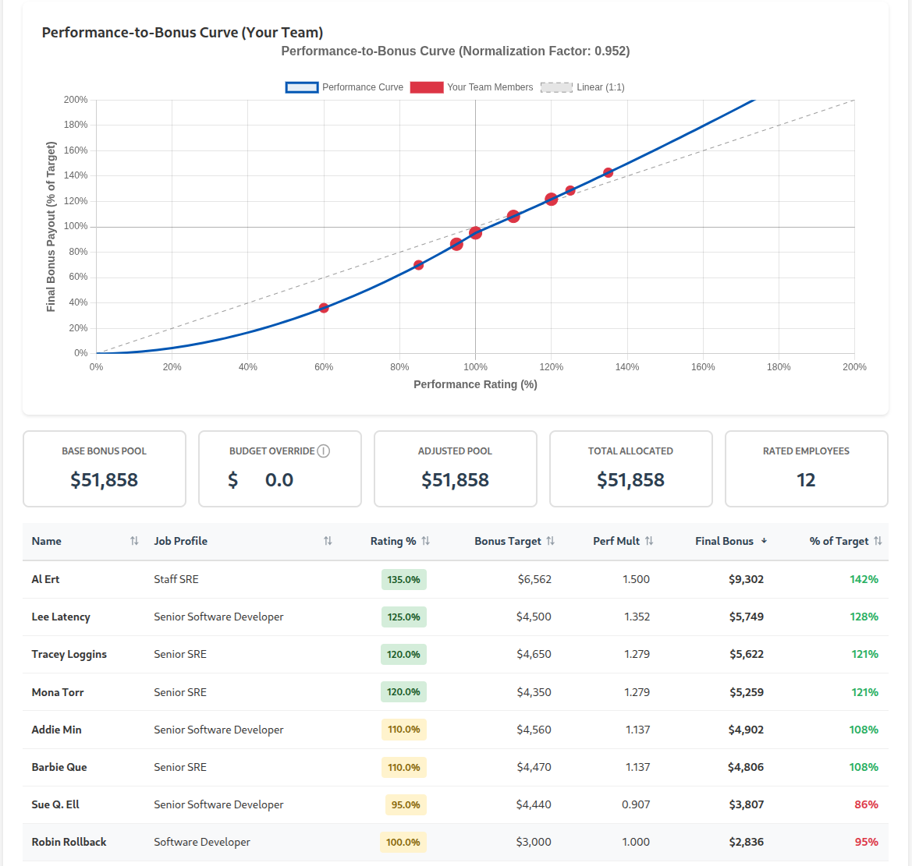
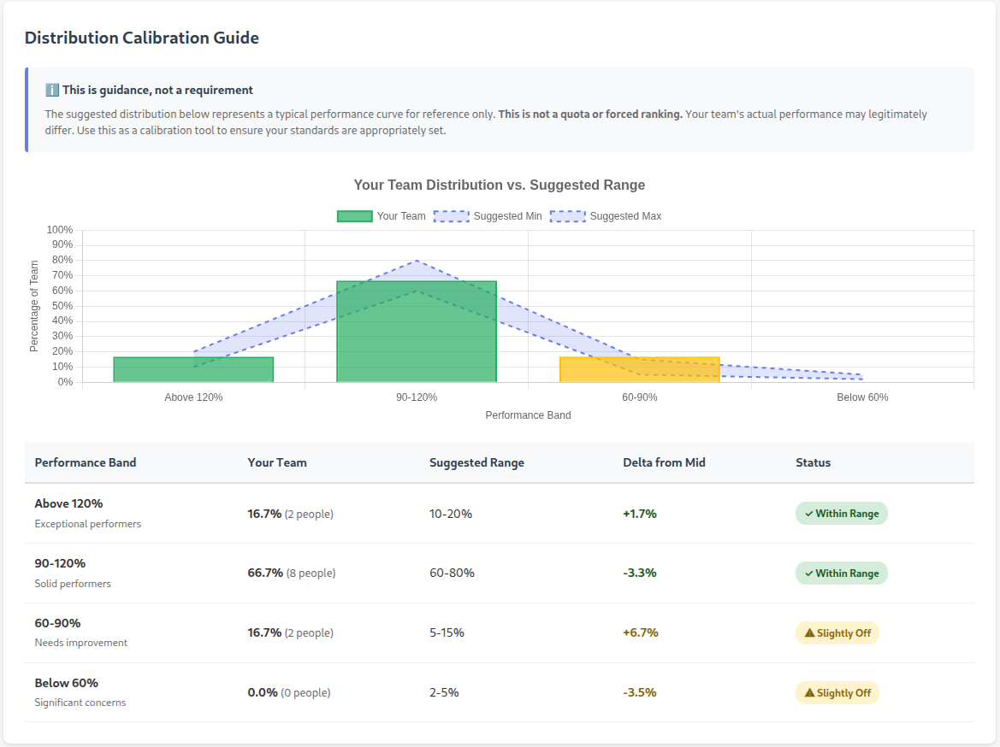

# Performance Rating System

A web-based tool for managers to conduct performance reviews and calculate team bonuses with algorithmic fairness.

## Features

- **Performance Rating Interface**: Rate team members on a 0-200% scale with justification
- **Auto-save**: Ratings save automatically as you work (2-second delay)
- **Analytics Dashboard**: View team performance distribution with calibration guidance
- **Bonus Calculation**: Algorithmic bonus allocation with configurable parameters
- **Fixed Pool Guarantee**: Total bonuses always equal your budget (sum of targets)
- **Historical Tracking**: Archive periods and view employee rating history over time
- **Period Comparison**: Compare current ratings with any historical period
- **Trend Analysis**: See performance trends with charts and improving/stable/declining indicators
- **International Support**: Handles multiple currencies (USD, GBP, EUR, CAD, INR)
- **Privacy-Focused**: SQLite database, runs locally, no cloud dependencies


*Performance-to-bonus allocation curve showing how ratings translate to bonuses with proportional scaling*

## Design Philosophy: Workday as Source of Truth

This tool is designed as a **local companion** to your HR system (Workday, or similar), not a replacement. The architecture maintains a clear separation:

**What comes FROM Workday (import):**
- Employee roster and identifiers
- Salaries and bonus targets
- Job profiles and org structure
- Currency information

**What stays LOCAL (manager-entered):**
- Performance ratings (0-200%)
- Justifications explaining ratings
- Team tenets evaluation
- Mentor/mentee relationships

**What goes BACK to Workday (export):**
- Final bonus allocations
- Rating justifications (for HR records)

**Why this matters:**
- **No duplicate data entry**: Employee info is maintained in one place (your HR system)
- **Safe re-imports**: Refreshing from Workday updates salaries and org changes without overwriting your ratings
- **Audit trail**: Your HR system remains the official record; this tool helps you get there
- **Portability**: Works with any HR system that can export to Excel

The workflow is: **Import → Rate → Calculate → Export**. Your HR system handles the before (employee data) and after (final allocations). This tool handles the middle (the actual performance evaluation work).

## Try the Live Demo

The easiest way to explore this tool is through the **public demo**:

**[Launch Demo](https://demo-perf-rating.apps.uoaar8p0.eastus.aroapp.io/)**

The demo features:
- **Session isolation**: Each visitor gets their own sandbox database
- **Pre-built sample data**: Choose between small team (12 employees) or large organization (50 employees)
- **Historical periods**: Demo includes 2-3 historical periods for testing trend analysis
- **Full functionality**: All features work exactly as they would with real data
- **No uploads**: Demo uses fictitious sample data only (import is replaced with "Generate Demo Data")

Your demo session is completely isolated from other users and will be automatically cleaned up after 1 hour of inactivity.

---

## Quick Start (Local Installation)

### 1. Clone and Run (macOS / Linux)

```bash
git clone https://github.com/adereis/performance-rating-and-bonus.git
cd performance-rating-and-bonus
./run.sh
```

The script automatically:
- Checks for Python 3.9+
- Creates a virtual environment
- Installs dependencies
- Starts the server and opens your browser

### Windows Users

```cmd
git clone https://github.com/adereis/performance-rating-and-bonus.git
cd performance-rating-and-bonus
run.bat
```

### 2. Try with Sample Data

Once the app is running, generate demo data to explore the features:

```bash
# In a new terminal, from the project directory:

# macOS/Linux - activate the virtual environment first
source .venv/bin/activate

# Generate sample Workday export (12 employees)
python3 scripts/create_sample_data.py

# Then in the browser:
# 1. Go to Import tab
# 2. Upload sample-data-small.xlsx
# 3. Start rating!

# Optional: Pre-populate sample ratings to see all features
python3 scripts/populate_sample_ratings.py small
```

## Sample Data Options

| Scenario | Step 1: Generate Data | Step 2: Populate Ratings |
|----------|----------------------|--------------------------|
| **Small team** (12 employees, 1 manager) | `python3 scripts/create_sample_data.py` | `python3 scripts/populate_sample_ratings.py small` |
| **Large org** (50 employees, 5 managers) | `python3 scripts/create_sample_data.py --large` | `python3 scripts/populate_sample_ratings.py large` |
| **With history** (6 quarters of data) | Add `--historical` flag to above | Same as above, then import `samples/sample-historical-*.xlsx` as Historical Periods |

After generating, import the `.xlsx` file via the **Import** tab, then run the populate script.

Both datasets include international employees (GBP) for multi-currency testing. Sample ratings range from 45-185% with justifications included.

## Docker Deployment

```bash
docker-compose up -d        # Start at http://localhost:5000
docker-compose down         # Stop
docker-compose up -d --build  # Rebuild after changes
```

Data persists in `./data` directory. See [docs/DOCKER.md](docs/DOCKER.md) for production deployment, commands reference, and running without docker-compose.

## Using Your Own Team Data

### Step 1: Export from Workday

Export your team data from Workday with these required columns:

**Required Columns:**
- Associate (employee name)
- Associate ID (unique identifier)
- Supervisory Organization
- Current Job Profile
- Current Base Pay All Countries
- Current Base Pay All Countries (XXX) - where XXX is manager's currency
- Currency
- Annual Bonus Target Percent
- Bonus Target - Local Currency
- Bonus Target - Local Currency (XXX) - where XXX is manager's currency

> **Note on International Teams:** Workday exports include columns with your home currency code in parentheses (e.g., `(USD)` for US managers, `(AUD)` for Australian managers). For employees in your country, this column is empty since their local currency matches yours. For international employees, it contains the converted value in your currency. The app automatically detects and uses the correct column regardless of your location.

**Optional Columns:**
- Photo
- Errors
- Grade (internal use, not shown to managers)
- Last Bonus Allocation Percent
- Notes

Save the export as `real-workday-export.xlsx` (or any name starting with `real-` - these are automatically ignored by git to protect your data)

### Step 2: Import Your Data

1. Start the web server: `python3 app.py`
2. Open http://localhost:5000
3. Navigate to **Import** tab
4. Upload your Workday export file
5. Choose **Current Period** import type
6. If switching from sample data, check **"Clear existing data before import"**
7. Click **Import Data**

This will:
- Import all employee records from Workday
- Initialize empty bonus rating fields
- Optionally clear any existing sample data

### Step 3: Start Rating

Navigate to **Bonus Rating** to begin entering bonus ratings.

## Workflow

### 1. Enter Bonus Ratings
- Navigate to **Bonus Rating** tab
- For each employee:
  - Enter bonus rating (0-200%, where 100% = met expectations)
  - Add justification explaining the rating
  - Optionally note mentors and mentees
- Ratings auto-save after 2 seconds of inactivity

### 2. Review Analytics
- Navigate to **Analytics** tab
- Review performance distribution across team
- Check calibration guidance (informational, not a requirement)
- View breakdowns by department and job profile

### 3. Calculate Bonuses
- Navigate to **Bonus Calculation** tab
- Review default parameters:
  - **Upside Exponent** (1.35): Rewards for ratings ≥ 100%
  - **Downside Exponent** (1.9): Penalties for ratings < 100%
- Adjust parameters if needed
- Click **Recalculate** to see results
- Review individual bonuses and % of target

### 4. Archive the Period
When you've completed ratings for a period:
- Navigate to **Dashboard**
- Click **Archive Period** button
- Enter a Period ID (e.g., `2024-H2`) and Name (e.g., `Second Half 2024`)
- Click **Archive Period**

This:
- Creates a snapshot of all current ratings
- Clears all ratings to prepare for the next period
- Preserves historical data for comparison

### 5. View Historical Data
- Click any employee name to open their detail modal
- Switch to the **History** tab to see:
  - Performance trend chart across periods
  - Trend indicator (improving/stable/declining)
  - Period-by-period breakdown with justifications

### 6. Compare Periods
- Navigate to **Analytics** tab
- In the **Period-over-Period Comparison** section:
  - Select a historical period from the dropdown
  - View who improved, declined, or stayed stable
  - See average rating changes across the team

### 7. Export Results

Currently manual (copy from UI). Future versions will support CSV export.

## Performance Rating Scale

| Rating | Meaning |
|--------|---------|
| 0-60% | Significant performance concerns |
| 60-90% | Needs improvement |
| 90-110% | Met expectations (solid performance) |
| 110-130% | Exceeded expectations |
| 130-200% | Exceptional performance |

**Note**: 100% is the baseline for "met all expectations". Most solid performers should be in the 90-110% range.


*Analytics dashboard showing performance distribution with calibration guidance to help ensure fair ratings across the team*

## Bonus Calculation Algorithm

See [BONUS_CALCULATION_README.md](docs/BONUS_CALCULATION_README.md) for detailed explanation.

**Summary**:
1. Total Pool = Sum of all bonus targets from Workday (in your currency)
2. Performance Multiplier = Split curve (different exponents for above/below 100%)
3. Raw Share = Target × Perf Multiplier
4. Final Bonus = Raw Share × Normalization Factor (ensures total = pool)

## Technology Stack

- **Backend**: Python 3, Flask
- **Database**: SQLite with SQLAlchemy ORM
- **Frontend**: HTML, CSS, JavaScript (vanilla)
- **Charts**: Chart.js
- **Excel**: openpyxl for Workday imports

## Testing

Run the test suite:

```bash
python3 -m pytest tests/ -v
```

Tests cover database operations, rating validation, bonus calculations, multi-org scenarios, Workday import/export, and historical data preservation.

## Privacy & Security

- **Local-only**: All data stays on your machine
- **No cloud**: SQLite database, no external dependencies
- **No telemetry**: No data sent to external services
- **Git-safe**: `.gitignore` excludes sensitive files:
  - `ratings.db` (your data)
  - `real-*.xlsx` (Workday exports)

## Troubleshooting

| Issue | Solution |
|-------|----------|
| "No such file or directory" on import | Export from Workday first, or generate sample data with `python3 scripts/create_sample_data.py` |
| Only some employees in bonus calculation | Ensure Workday export has both "Bonus Target - Local Currency" columns (local and converted) |
| Ratings not saving | Check browser console; ensure server is running (`python3 app.py`) |
| "Database locked" error | Close other processes using `ratings.db`; restart Flask app |

**Refreshing from Workday**: Import new export via **Import** tab → **Current Period** (don't check "Clear existing data"). Workday fields update but your ratings are preserved.

## Contributing

This is a manager tool for internal use. Contributions welcome:

1. Fork the repository
2. Create a feature branch
3. Add tests for new functionality
4. Submit a pull request

## License

MIT License - see LICENSE file for details

## Support

For issues or questions:
- Check this README and [BONUS_CALCULATION_README.md](docs/BONUS_CALCULATION_README.md)
- Review test suite for examples: `tests/test_app.py`
- Open an issue on GitHub
